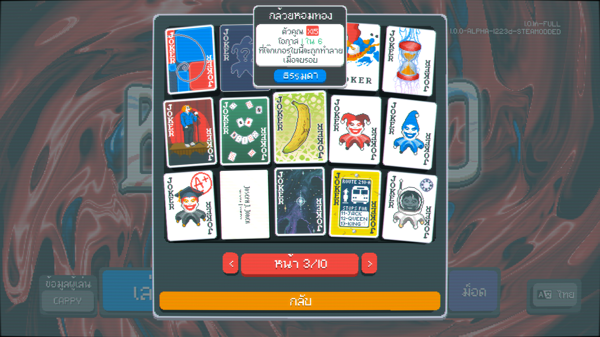
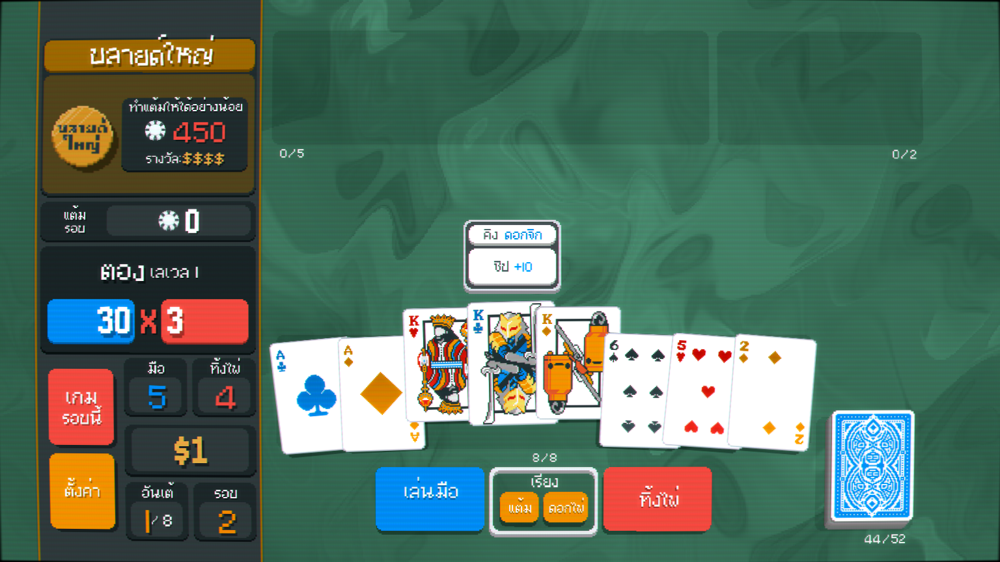
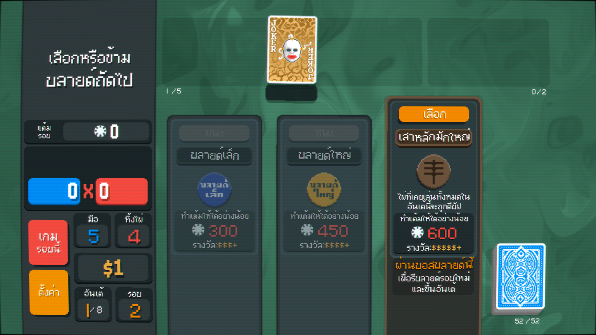

# Thai Balatro - Sober Edition บาลาโทรภาษาไทยฉบับสร่างเมา






พาสาปะกิดอยู่ข้างล่าง - English README is below

ม็อดนี้เป็นฟอร์กของ [Thai Balatro mod] โดย [ไม่เมาไม่แปล](https://www.facebook.com/maimaomaiplae) บนเฟซบุ๊ค เพื่อที่จะให้การแปลในเกมมีคุณภาพมากขึ้น

ใช้เกมเวอร์ชัน 1.0.1n-FULL

## สิ่งที่เปลี่ยนไปจากม็อดเดิม

> [!NOTE]  
> ยังไม่เสร็จสมบูรณ์

- แปลให้มันไม่เมาและเข้าใจง่ายขึ้น
- เปลี่ยนฟ้อนที่ให้มาจาก `Mali` เป็น `2005_iannnnnAMD` เพื่อที่จะได้พอเข้ากับเกมเดิม
- แปลชิป Small Blind และ Big Blind (วาดเอง)

## วิธีการลงบน Windows (ไม่ใช้ Steamodded)

1. โหลด [Lovely Injector] โดยการแตกไฟล์ `lovely-x86_64-pc-windows-msvc.zip` และนำไฟล์ `version.dll` ไปวางในโฟลเดอร์ของเกม

2. ไปที่ `%APPDATA%\Balatro` และคัดลอกโฟลเดอร์ `resources`, `mods`, และ `localization` ไปวางที่นั่น

3. เปิดเกมแล้ว Lovely Injector จะบอกว่าแพชเข้า `game.lua` แล้ว

4. เลือกภาษาไทยในเกม

## วิธีการลงบน Windows (ใช้ Steamodded)

1. ลง [Steamodded] ตามขั้นตอนที่เขาให้

2. โหลดม็อดเวอร์ชัน Steamodded จากหน้า Releases (หรือ [Actions](https://github.com/korewaChino/balatro-thai/actions)) และแตกไฟล์ไปที่ `%APPDATA%\Balatro\Mods`

## สำหรับผู้เล่นบน Proton (Linux)

1. ทำตามข้างบน แต่อาจจะเปลี่ยน %APPDATA% เป็น `~/.steam/steam/steamapps/compatdata/2379780/pfx/drive_c/users/steamuser/AppData/Roaming/Balatro/`.

2. ตั้งค่า Launch Options ใน Steam เป็น `WINEDLLOVERRIDES="version.dll=n,b" %command%` เพื่อให้ Proton โหลด DLL ของ Lovely Injector

## อยากช่วยเหรอ

ถ้าอยากช่วยเพิ่มเติมในม็อดก็ Fork และส่ง Pull Request มาได้ หรือถ้ามีข้อสงสัยก็สามารถเปิด Issue ได้เลย :D

---

English

This mod is a fork of the [Thai Balatro mod] by [maimaomaiplae](https://www.facebook.com/maimaomaiplae). It aims to improve and further localize the game for Thai players.

Updated for 1.0.1n-FULL

## Changes from the original mod

- Properly localize item names and descriptions
- Replaced default typeface from `Mali` to `2005_iannnnnAMD` for a more consistent pixel art look

## Installing the mod on Windows (Without Steamodded)

1. Install [Lovely Injector] by downloading the latest release and placing the `version.dll` file in the game folder

2. Go to `%APPDATA%\Balatro` and copy the `resources`, `mods`, and `localization` folders from this repository into the game folder

3. Launch the game. Lovely Injector should notify that patches have been applied to `game.lua`

4. Select Thai in the game settings

## Installing the mod on Windows (With Steamodded)

1. Follow upstream instructions on how to install [Steamodded]

2. Download the Steammodded distribution from the releases page (or [CI](https://github.com/korewaChino/balatro-thai/actions)) and extract it to `%APPDATA%\Balatro\Mods`

## Proton-specific instructions

1. Follow Step 1 and 2 from the Windows instructions. You may replace %APPDATA% with `~/.steam/steam/steamapps/compatdata/2379780/pfx/drive_c/users/steamuser/AppData/Roaming/Balatro/`.

2. Set Steam's launch options to `WINEDLLOVERRIDES="version.dll=n,b" %command%` so Proton loads the Lovely Injector DLL

## Building the mod for Steamodded

The Standalone version can be simply copied from source, but the Steamodded version has a merge script that eases development by allowing multiple input files for the translation keys. To build the mod for Steamodded, you will need the Lua interpreter. You may simply run the package script to generate the mod files.

```sh
scripts/pack_steamodded.sh
```

### On Windows without the helper script

Download the Lua interpreter from the official website and run the script using the interpreter. Open Windows Terminal and navigate to the project directory and follow the steps below.

1. Create the necessary directories

    ```cmd
    mkdir dist
    mkdir dist\THLocale-Steamodded
    mkdir dist\localization
    ```

2. Run the Lua script to compile the strings

    ```cmd
    lua scripts\pack_steamodded.lua
    ```

3. Copy/move/delete the necessary files

    `mods/ThaiLoc` -> `dist/THLocale-Steamodded`

    `resources/textures` -> `dist/THLocale-Steamodded/assets`

    `resources/fonts` -> `dist/THLocale-Steamodded/assets/fonts`

    `dist/localization` -> `dist/THLocale-Steamodded/localization`

    Delete the `lovely` folder from `dist/THLocale-Steamodded` since it's a patch exclusive for the non-Steamodded version

## Contributing

If you'd like to contribute to the mod, feel free to fork the repository and submit a pull request. If you have any questions, feel free to open an issue! :D

[Lovely Injector]: https://github.com/ethangreen-dev/lovely-injector
[Thai balatro mod]: https://www.nexusmods.com/balatro/mods/37
[Steamodded]: https://github.com/Steamopollys/Steamodded
